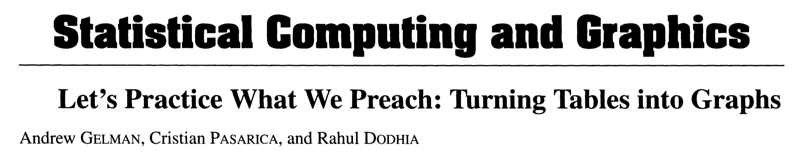
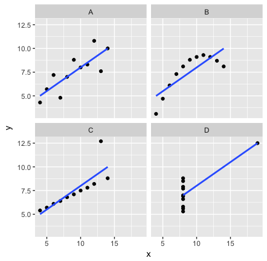
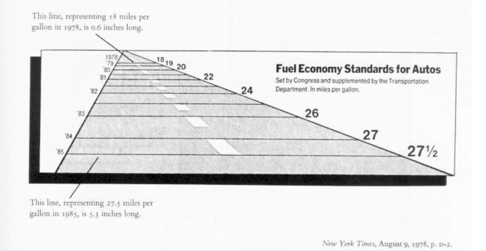
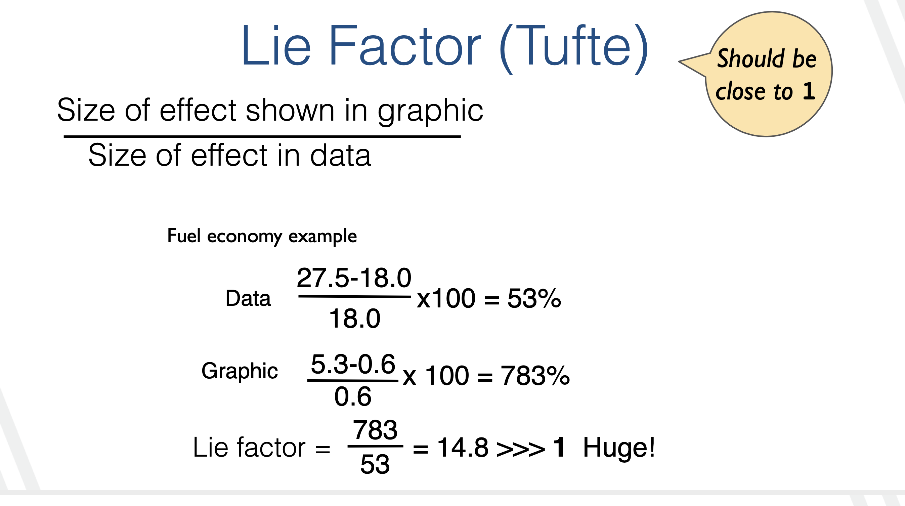
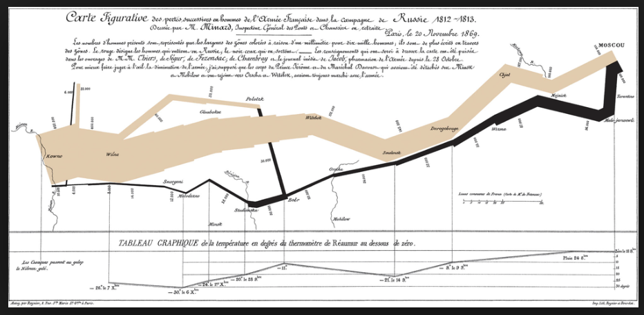
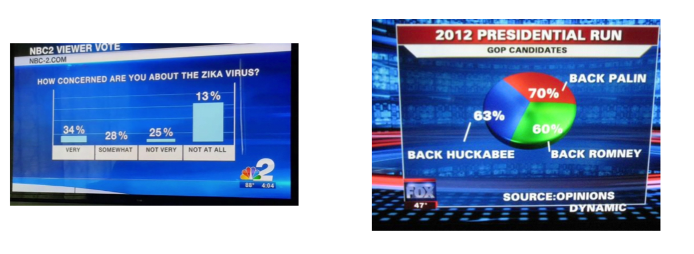
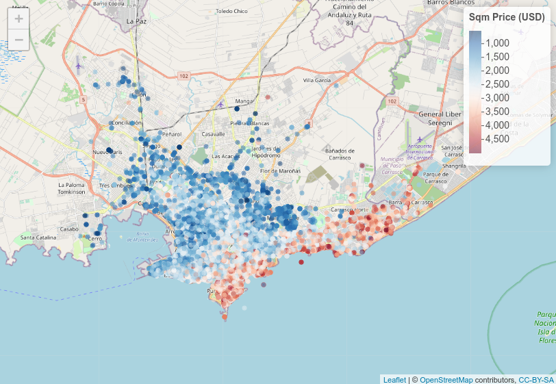
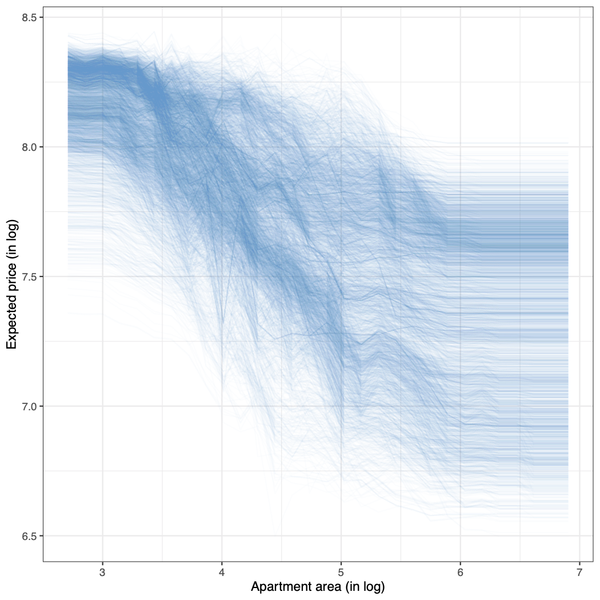
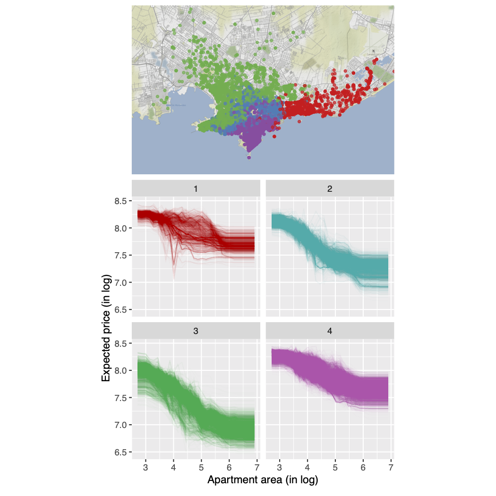

```{r setup, include=FALSE}
options(htmltools.dir.version = FALSE)
library(RefManageR)
BibOptions(check.entries = FALSE, bib.style = "authoryear", style = "markdown",
           dashed = TRUE)
#file.name <- system.file( "bibliophd.bib", package = "RefManageR")
bib <- ReadBib("bibliophd.bib")
knitr::opts_chunk$set(echo = FALSE, warning = FALSE, message = FALSE)
```

## <span style="color:#88398A">Importancia de la visulización</span> 
  
"The greatest value of a picture is when it forces us to notice what we never expected to see."`r Citet(bib, "tukey77")`


<!-- "Graphs provide powerful tools both for analyzing scientific data and for communicating quantitative information" `r Citet(bib, "cleveland")` -->

---

 
## <span style="color:#88398A"> Visualización Estadística</span>
  
  La visualización juega un rol importante en todas las etapas del análisis estadístico.

- **Exploración:** Encontrar patrones generales y específicos en los datos.

- **Modelado:** Chequear supuestos sobre los datos antes de modelar.
Se puede hacer inferencia gráfica (nueva linea).

- **Diagnóstico:** Visualizar el modelo en el espacio de los datos ó los datos en el espacio del modelo.


Herramienta fundamental para la ciencia de datos moderna cuyo uso ha sido facilitado por el desarrollo computacional.
---
  
  
## <span style="color:#88398A"> ¿Cuál es la relación entre X e Y?</span>
```{r, echo=FALSE}
library(knitr)
library(dplyr)
library(kableExtra)
library(tidyverse)
X <- c(1.972, 1.112, 0, 0.665, 0.235, 0.247, 1.275, 0.702, 1.76, 1.691, 1.628, 1.957 ) 
Y <- c(1.236, 1.994, 1.009,1.942,	0.356,1.658,1.961,0.045,0.35,0.277,1.778,	1.29)

dat <- data.frame(X,Y)
kable(dat)%>%
  kable_styling( "bordered",full_width = F, font_size = 15)

```

---

## <span style="color:#88398A"> ¿Porqué usamos visualización?</span>


```{r, fig.width = 4, fig.height = 4, fig.align='center'}
library(ggplot2)
ggplot(data = dat) + geom_point(aes(X, Y))
```
---
  
 

## <span style="color:#88398A"></span> 



- Los estadísticos recomiendan el uso de gráficos pero a menudo no siguen esta recomendación cuando presentan su propia investigación.

- Ellos analizan algunos artículos en JASA y muestran algunos ejemplos de como transformar tablas en gráficos.

- Ellos dicen que hay una buena razón para ser haraganes, ya que toma mucho tiempo hacer una buena visualización.

- Buenos gráficos son posibles, especialmente cuando pensamos en la razón de querer mostrar los valores en primer lugar.

-  Si las revistas top en el área de estadística no lo hacen bien aún, existe espacio para seguir mejorando.

`r Citet(bib, "gelman2002let")`

---


<!-- Poca atención se le ha prestado a los principios de la visualizción en los libros más clásicos de estadística. -->
<!--  Por lo que es una buena razón para enseñar visualización más en cursos introductorios y de computacion y no esperar a cursos avanzados -->

  

## <span style = "color:#883984">Cuanto es la media muestral para x e y? </span>
```{r,fig.height=6,fig.width=6}
library(datasauRus)
datasaurus_dozen %>% filter(dataset == "slant_up")%>%
  ggplot() + geom_point(aes(x,y)) + theme(axis.text.x  = element_text(size = 20), axis.text.y = element_text(size = 20), axis.title.x = element_text(size=20), axis.title.y=element_text(size=20))

```
--
  
```{r}
a <- datasaurus_dozen %>% filter(dataset == "slant_up") %>%
  dplyr::select(x,y) %>% summarise(mean(x), mean(y)) 

```
$\bar x =$ `r round(a[[1]],2)`  y     $\bar y =$ `r round(a[[2]],2)`

---
  

  
  
## <span style = "color:#883984">Cuanto es la media muestral para x e y? </span>

```{r,fig.height=6,fig.width=6}

datasaurus_dozen %>% filter(dataset == "dino")%>%
  ggplot() + geom_point(aes(x,y)) + theme(axis.text.x  = element_text(size = 20), axis.text.y = element_text(size = 20), axis.title.x = element_text(size = 20), axis.title.y = element_text(size = 20))

```
--
  
```{r}
a <- datasaurus_dozen %>% filter(dataset == "dino") %>%
  dplyr::select(x,y) %>% summarise(mean(x), mean(y)) 

```
$\bar x =$ `r round(a[[1]],2)` y     $\bar y =$ `r round(a[[2]],2)`

---
  
  
## <span style = "color:#883984">¿Porqué usamos visualización?  </span>


     
- https://github.com/stephlocke/datasauRus  `r Citet(bib, "matejka2017same")`
- Mismos resumenes estadísticos, pero distribuciones muy diferentes
- [Link algoritmo](https://www.autodeskresearch.com/publications/samestats).
  
---
## <span style = "color:#883984">¿Porqué usamos visualización? </span>
.pull-left[  
-  Los gráficos proveen más información que los resúmenes numéricos
-  Anscombe’s quartet `r Citet(bib, "anscombe")`
- $n = 11$ 
- $\bar x= 9.0$ 
- $\bar y = 7.5$ 
- $\hat \beta_1= 0.5$ 
- $y = 3 + 0.5 x$ 
- $R^2 = 0.667$ 
- $....$
]
.pull-right[

]

---

## <span style="color:#88398A"></span> 


En este artículo Gelman se pregunta:

**"If graphs are so great, why are they not more popular?"**

Respuesta: 

**"Good statistical graphics are hard to do, much harder than running regressions and making tables."**
 

---
## <span style = "color:#883984">Visualización de datos</span>

- La visualización de datos debe comunicar precisamente los datos sin distorsionarlos.

- Si un número es tres veces más grande que otro pero en la visualización lucen casi iguales entonces la visualización es incorrecta.

- A su vez la visualización debe ser estéticamente agradable, no contener elementos que distraigan para transmitir el mensaje que se quiere.

---

## <span style = "color:#883984">Visualizaciones efectivas</span>
- No todas las visualizaciones son igualmente efectivas

- Hay diferentes criterios para evaluar gráficos (Cleveland, Tufte, Car, Wainer, etc)

- Basado en el estudio de la percepción gráfica

- Las mejores visualizaciones son aquellas que requieren el uso de la visión "pre-attentive" (instantáneo, sin aparente esfuerzo visual)  `r Citet(bib, "cleveland")`.

---

## <span style = "color:#883984">Reglas de Tufte</span>

1. Mostrar los datos

2. Inducir al observador a pensar en los datos

3. Evitar distorsionar lo que los datos deben decir

4. Presentar muchos números en un espacio reducido

5. Hacer coherentes grandes volúmenes de datos

6. Mostrar los datos a varios niveles de detalle

7. Sirvan para un propósito razonable

8. que se relacione cercanamente con la estadística y la descripción verbal de los datos
---


## <span style = "color:#883984">1. Mostrar los datos</span>

.pull-left[  
- Brote de cólera en 1854 en Londres, Jhon Snow (médico Inglés)

- Datos: son los muertos por cólera y locación de las bombas de agua

- Estructura: un mapa de calles
]
.pull-right[

]

---


## <span style = "color:#883984">3. Evita distorsionar los datos</span>

---

## <span style = "color:#883984">3. Evita distorsionar los datos</span>



---

## <span style="color:#88398A">Minard Map</span>  
“The best statistical graphic ever drawn" según Edward Tufte 


---

## <span style="color:#88398A"> Comparar variables cuantitativas</span>
Trabajo de Cleveland sobre percepción gráfica `r Citet(bib, "cleveland")` ordena la dificultad de los elementos gráficos basado en la percepción para estimar variables cuantitativas.

**De la más sencilla a la más difícil en términos de percepción:**

1. Posición a lo largo de una escala común
2. Posición en escalas no alineadas pero idénticas
3. Longitud
4. Ángulo o pendiente
5. Área
6. Volumen, densidad o saturación del color
7. Tono del color
---


## <span style="color:#88398A"> ¿Cómo uso esto?</span>
- Cuál es la comparación más importante que quiero hacer cuando tengo variables cuantitativas.

- Tenemos que codificar eso que quiero comparar usando los elementos gráficos en la tabla en orden.

- El elemento gráfico más sencillo para estimar variables cuantitativas en términos de percepción es la posición a lo largo de una escala común y lo más difícil es usar tonos de colores.
---

## <span style="color:#88398A"> Millas por galón (mpg), comparo elementos gráficos</span>

```{r, fig.width=12, fig.height=7}
library(patchwork)
p1 <- mtcars %>% mutate(manufacturer = rownames(mtcars)) %>%  
  ggplot() + geom_bar(aes(x = fct_reorder(manufacturer,mpg), y = 1, fill = mpg), stat = "identity", position = "fill") + coord_flip() + scale_fill_distiller(palette = "Spectral") + labs( x = "Modelos", title = "7. Tono del color") + theme(axis.title.x = element_blank(),
        axis.text.x = element_blank(),
        axis.ticks.x = element_blank())
p2 <- mtcars %>% mutate(manufacturer = rownames(mtcars)) %>%  
  mutate(ran = rchisq(nrow(mtcars), 2.5)) %>%
ggplot() + 
  geom_segment(aes(y = fct_reorder(manufacturer,mpg), x = ran,
                   yend = manufacturer, xend = ran + mpg), size = 4) + labs(y = "Modelos", title ="3. Longitud" ) + theme(axis.text.x = element_blank(),                                       axis.ticks.x = element_blank(),
                          axis.title.x = element_blank()) 


p3 <- mtcars %>% mutate(manufacturer = rownames(mtcars)) %>%
ggplot() + geom_point(aes(x = mpg, y = fct_reorder(manufacturer, mpg) )) + labs(y =  "Modelos", title =" 1. Posición a lo largo de una escala común")                                                 

p1 + p2 + p3 + plot_layout(ncol=3)
```
---

## <span style="color:#88398A"> Millas por galón (mpg), comparo elementos gráficos</span>

```{r, fig.width=12, fig.height=7}

p1 <- mtcars %>% mutate(manufacturer = rownames(mtcars)) %>%  
  ggplot() + geom_bar(aes(x = manufacturer, y = 1, fill = mpg), stat = "identity", position = "fill") + coord_flip() + scale_fill_distiller(palette = "Spectral") + labs( x = "Models", title = "") + theme(axis.title.x = element_blank(),
        axis.text.x = element_blank(),
        axis.ticks.x = element_blank())
p2 <- mtcars %>% mutate(manufacturer = rownames(mtcars)) %>%  
  mutate(ran = rchisq(nrow(mtcars), 2.5)) %>%
ggplot() + 
  geom_segment(aes(y = manufacturer, x = ran,
                   yend = manufacturer, xend = ran + mpg), size = 4) + labs(y = "Models", title =  "") + theme(axis.text.x = element_blank(),                                       axis.ticks.x = element_blank(),
                          axis.title.x = element_blank()) 
 
p3 <- mtcars %>% mutate(manufacturer = rownames(mtcars)) %>%
ggplot() + geom_point(aes(x = mpg, y = manufacturer)) + labs(y =  "Models")                                                 

p1 + p2 + p3 + plot_layout(ncol=3)
```
---

## <span style="color:#88398A">4. Ángulo ó pendiente</span>

- Gráficos de torta son una mala elección!

- Pero ahora sabemos porqué, en base al artículo de Cleveland 

- Porque decodificar variables cuantitativas usando ángulos es más difícil que con otros elementos gráficos
  1. Posición a lo largo de una escala común
  2. Posición en escalas no alineadas pero idénticas
  3. Longitud.

- Siempre es preferible un gráfico de barras a uno de torta.

- Los gráficos de donas presentan los mismos problemas que los de torta en términos de percepción y no los recomendamos.

---

## <span style="color:#88398A">Visualización para comunicar...</span>




---


## <span style="color:#88398A">Algunos Desafíos</span>

- **Calidad e Integración de Datos** Diversas fuentes de información que deben ser combinadas de forma consistente. Limpieza y depuración de datos es fundamental


<!-- Seleccio: Seleccionar la técnica de visualización más apropiada para un conjunto de datos y objetivo determinados puede resultar desafiante. Diferentes tipos de datos (numéricos, categóricos, temporales) requieren enfoques de visualización distintos (gráficos de barras, gráficos de dispersión, líneas de tiempo, entre otros). -->

- **Datos grandes y complejos** desafíos en término de procesamiento, rendimiento y escalabilidad.
No todas las herramientas visuales pueden ser utilizadas, uso de muestreo, visualizaciones interactivas, métodos que impliquen reducción de dimensiones.

<!-- Mantenimiento de la Privacidad y Seguridad de los Datos: Las visualizaciones a menudo involucran datos sensibles, y garantizar la privacidad y seguridad es fundamental. Equilibrar la necesidad de transparencia y accesibilidad con la protección y anonimato de los datos puede resultar un desafío significativo, especialmente cuando se trata de información personal o confidencial. -->
<!-- Narración e Interpretación: Una visualización de datos efectiva debe contar una historia convincente y permitir que los espectadores obtengan información significativa. Diseñar visualizaciones que transmitan el mensaje deseado, resalten patrones importantes y faciliten una interpretación precisa requiere una cuidadosa consideración de la audiencia objetivo y su conocimiento previo. -->

<!-- Accesibilidad y Usabilidad: Las visualizaciones de datos deben ser accesibles para una amplia gama de usuarios, incluidos aquellos con discapacidades. Garantizar el contraste de colores, proporcionar descripciones alternativas de texto y utilizar tecnologías accesibles son fundamentales para hacer que las visualizaciones sean utilizables e inclusivas. -->

- **Datos en Tiempo Real y Dinámicos:** La visualización de datos en tiempo real o dinámicos introduce desafíos adicionales. La visualización debe actualizarse y adaptarse en tiempo real, y la interfaz de usuario debe admitir la exploración interactiva de flujos de datos cambiantes.

- **Diseño Móvil y Responsivo:** Con el aumento del uso de dispositivos móviles, las visualizaciones de datos deben ser responsivas y optimizadas para diferentes tamaños y resoluciones de pantalla. 

- Más....
<!-- Diseñar visualizaciones efectivas para pantallas pequeñas manteniendo la usabilidad y legibilidad puede ser desafiante. -->

<!-- Elección de Técnicas de Interacción Efectivas: Las visualizaciones interactivas ofrecen a los usuarios la posibilidad de explorar e interactuar con los datos. Diseñar técnicas de interacción intuitivas y efectivas, como zoom, filtrado y selección, requiere un profundo conocimiento de las necesidades y comportamiento del usuario. -->


---

## <span style="color:#88398A">Ejemplo precio Inmuebles Montevideo</span>

Datos sobre precio ofertado de apartamentos en Montevideo entre Febrero 2018 y Enero 2019 (70867 observaciones, 116 variables)

Algunos objetivos:
 - Modelos predictivos para el precio ofrecido en metros cuadrados usando métodos de aprendizaje supervisado.
 
 - Aplicar métodos interpretables para analizar los resultados de los modelos predictivos.
---

## <span style="color:#88398A">Ejemplo precio Inmuebles Montevideo</span>




---

## <span style="color:#88398A">Ejemplo precio Inmuebles Montevideo</span>

- Curvas ICE sou usadas para visualizar la relación entre la variable de respuesta y variables explicativas para cada observación individual. 

- Estas curvas pueden ser de utilidad para analizar efectos heterogeneos.

- Pero cuando trabajamos con un conjunto de datos grandes es difícil de analizar los resultados.
---


## <span style="color:#88398A">Ejemplo precio Inmuebles Montevideo</span>
Curvas ICE para RF, muestreando observaciones:




---

## <span style="color:#88398A">Ejemplo precio Inmuebles Montevideo</span>

- En problemas donde la estructura espacial es importante para el problema se podría usar la misma para agrupar curvas usando la misma.


- Extensión de curvas ICE (SpICE-curves) usando restricciones espaciales para ello (working paper, da Silva et.al) usando cluster jerárquicos con restricciones espaciales.

---

## <span style="color:#88398A">Ejemplo precio Inmuebles Montevideo</span>
SpICE-Curves



---


## <span style="color:#88398A">Comentarios Finales</span>

- Las visualizaciones son importantes en todas las etapas del análisis estadísticos

- Se deberían usar más de lo que se usan, pero como dice Gelman es difícil, es más sencillo pegar tablas

- Muchos desafíos que requieren una batería de habilidades 

- Y por suerte van a tener una buena formación en el diploma para atacar algunos de estos desafíos y poder comunicar de forma efectiva.

---

## <span style="color:#88398A"></span>


<p style="text-align: center;"> <font size="7">MUCHAS GRACIAS! </font> </p>


---


# References

```{r, results='asis', echo=FALSE}
PrintBibliography(bib)
```
---   


<!-- # References  -->

<!-- ```{r, results='asis', echo=FALSE} -->
<!-- PrintBibliography(bib, start =9, end=10) -->
<!-- ``` -->
<!-- ---   -->